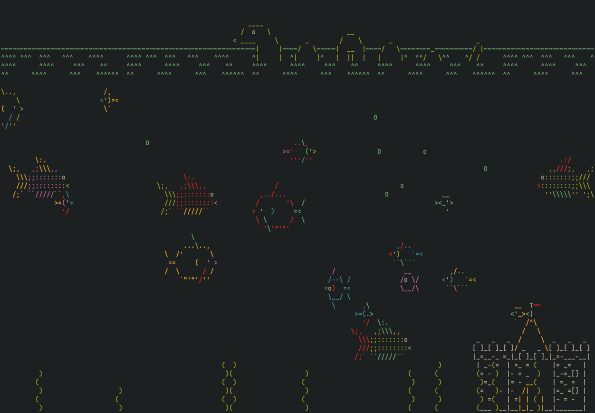

# Gocean

**Gocean** is an aquarium/sea animation rendered entirely in ASCII art.  
Enjoy the mysteries of the sea from the safety of your own terminal!

Gocean is a Go port of the classic **Asciiquarium** by [Kirk Baucom](https://robobunny.com/projects/asciiquarium/html).  
It reimagines the original Perl animation with modern Go features and improved performance.



## Features

- Real-time ASCII animation in your terminal.
- User-defined frame rate (default: 120 FPS).
- Fixed-timestep simulation independent of render speed.
- Efficient buffer management for high frame rates.
- Fully written in Go using the [Bubble Tea](https://github.com/charmbracelet/bubbletea) framework.

## Acknowledgments

All ASCII art originates from the original Asciiquarium.  
Much of the artwork was created by **Joan Stark**.  
See her full collection archived here:  
[https://oldcompcz.github.io/jgs/joan_stark/index.html](https://oldcompcz.github.io/jgs/joan_stark/index.html)

## Installation

```bash
go install github.com/myka0/gocean/cmd/gocean@latest
```

This will install the `gocean` binary into your `$GOBIN`.

## Usage

Run directly from your terminal:

```bash
gocean
```

### Keybindings

| Key | Description |
| --- | --- |
| `q` | Quit the application. |
| `p` | Pause/unpause the simulation. |
| `r` | Reset the simulation. |

### Command-Line Options

| Flag | Description |
| --- | --- |
| `-h`, `--help` | Show help message and exit. |
| `-fps`, `--fps` | Set the frame rate. 0 for unlimited. (default: 120 FPS). |
| `-debug`, `--debug` | Enable debug mode. |

## Usage as a Library

Gocean exposes a simple API under the root module `github.com/myka0/gocean`.

### Available Functions

#### NewProgram

Creates and returns a new Bubble Tea program configured to run the Gocean aquarium.

```go
func NewProgram() *tea.Program
```

The returned `*tea.Program` can be executed directly with `.Run()` to create a standalone application.

```go
package main

import (
	"log"

	"github.com/myka0/gocean"
)

func main() {
	p := gocean.NewProgram()

	if _, err := p.Run(); err != nil {
		log.Fatal(err)
	}
}
```

This is equivalent to running the `gocean` binary directly.

#### InitModel

Initializes and returns a new Gocean model, suitable for use in custom Bubble Tea programs.

```go
func InitModel(width, height int, debug bool, maxFPS int) *model
```

The returned model implements the standard Bubble Tea interface:

* `Init() tea.Cmd`
* `Update(msg tea.Msg) (tea.Model, tea.Cmd)`
* `View() string`

This allows you to embed Gocean’s simulation as part of a larger Bubble Tea application.

## License

Gocean is licensed under the [GNU GPL v3.0](LICENSE).

---

> “The sea, once it casts its spell, holds one in its net of wonder forever.” — Jacques Cousteau
